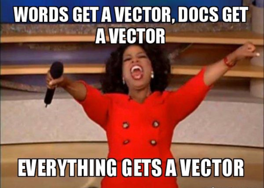

* [Home](../index.md)

# Word Embeddings

**Chapter in progress... Meanwhile here is a meme:**

<figcaption> <a href="https://humboldt-wi.github.io/blog/research/information_systems_1718/04topicmodels/">Image source</a> </figcaption>

and a very good blog post about word embeddings: [https://ruder.io/word-embeddings-1/](https://ruder.io/word-embeddings-1/)

  <a href="chap_8.html" style="float: left;">❮ Previous chapter</a>
  <a href="chap_9.html" style="float: right;">Next chapter ❯</a>

  