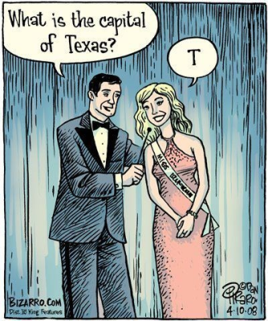
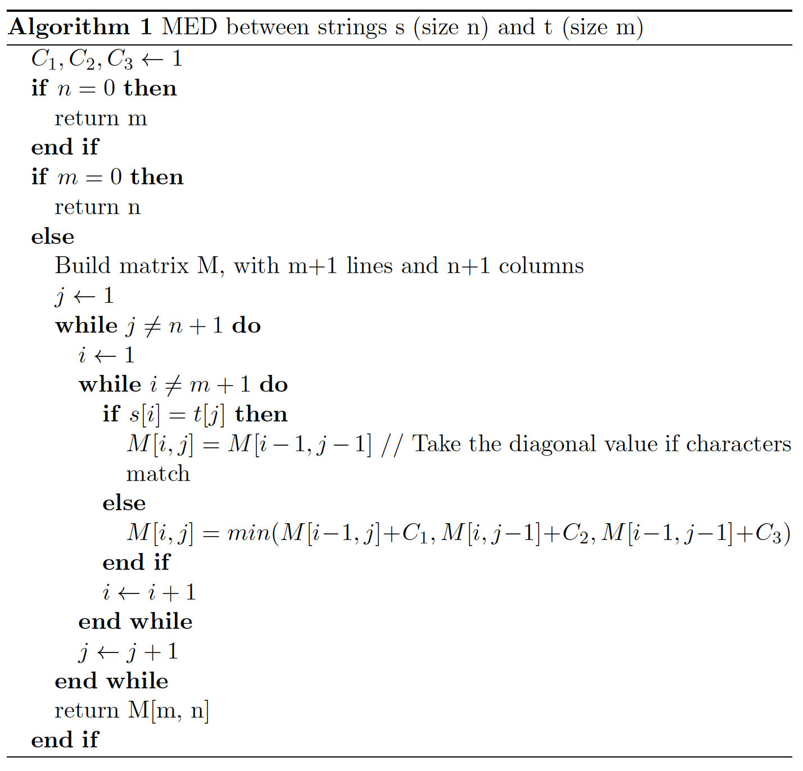

* [Home](../index.md)

<p align="center">
<iframe width="350" height="197" src="https://www.youtube.com/embed/PTsSk0r_Tq8" frameborder="0" allow="accelerometer; autoplay; encrypted-media; gyroscope; picture-in-picture" allowfullscreen></iframe>
</p>
> As we will see its not just for F.R. David that words don't come easy...

# Words don’t come easy

> Text by: [Luísa Coheur](authors.md)

In this chapter we will study words. As we will see, not even its definition
is so obvious as it might seems. You will learn what we do to words in
NLP and believe me, we are not nice with the poor words: we cut them in
little pieces, we analyze the little pieces, we compare the little pieces, we
play with their sounds and, sometimes, we simply eliminate words, with no
mercy (Muahahahaha!).

## The meaning of the word "word"

What does the word "word" means? Well, consider the following sentence:


&nbsp;&nbsp;&nbsp;&nbsp;&nbsp;_Na Sexta-feira hei-de ir a Viana do Castelo a pé._

How many words are there in this sentence? You probably counted 10.
Hum...

* _Na_ is a contraction (preposition _em_ plus article _a_). Should we count one or two words?
* _Sexta-feira_ seems to be a word, but somebody may argue that _sexta_ and _feira_ are also words, right?
* With the new orthography _hei-de_ becomes _hei de_. Thus, _hei de_ represents two words and _hei-de_ a single word. So...
* Shouldn't _Viana do Castelo_ be counted as a single word as its meaning depends on the three words altogether?
* What about the two occurrences of the word _a_? Do they represent the same word or there is some subtle difference between them? Should we count it once or twice?

According to Priberam's dictionary, a word, in computer science, is defined
as: *Elemento de informação armazenado ou tratado sem interrupção
num computador* they also define word as a term. What do they mean
when they say _sem interrupção_? And what does _term_ exactly mean?

&nbsp;&nbsp;&nbsp;&nbsp;&nbsp;I was never able to find a consensual definition of word. The previous
definitions probably match what many people have in mind. However, for
people working in NLP the concept depends on the application and, thus,
we consider that something is a word (or not) if this helps our work.

## Tokenization

Tokenization (or word segmentation) is the (not so trivial) process of
identifying tokens in a text. Considering what you have previously seen,
this process will depend on what you call "a word". Therefore, the first
thing to do is to decide which sequences of words should be considered as a
single one. Then, punctuation is on your way and you will have to deal with
that... Do you think you can properly handle tokenization? Well... maybe
you can, if you consider the Portuguese language. However, remember that
many other languages exist and that some have specificities that can turn
tokenization into a really challenge (not to say nightmare). In the following
you will understand what I mean.

### Compounds

As previously stated, it might be important to treat all the compound
terms, like _Viana do Castelo_, as single words (it is obvious that the unity
of meaning is, in this case, the city _Viana do Castelo_). You might be tempted
to think that only proper nouns (such as _Joana Martins_, _Rua de Campolide_
or _Instituto Superior Técnico_) are in this situation, and that these are easy
to identify (first mistake!), but you are wrong: more than proper names can
be included in this process. For instance, what about _chapéu de chuva_ that
is no longer written with the hyphen? Or _rampa para deficientes_?

&nbsp;&nbsp;&nbsp;&nbsp;&nbsp;Once again, depending on your application, it can be useful to group
some sequences of nouns that linguists would not even call compounds. In
some cases, you can build a lexicon containing these words, which will help
your task. However, even in restricted domains some automatization is
(probably) needed to generate the different/alternative forms of the words
in the compounds. Nevertheless, as some of the words in these sequences
can be expanded and others can't (as an example, we can say _chapéus de
chuva_, but not _chapéus de chuvas_; you can also say _rampa para deficientes_
or _rampa de deficientes_), the task of building patterns to automatically
generate all the associated forms is also complicated.

&nbsp;&nbsp;&nbsp;&nbsp;&nbsp;So, in conclusion, depending on the application, you might decide to
group compounds as a single unit of meaning or not. It might be really helpful to group them before 
moving to a posterior analysis, but it can be complex to do it.

### Punctuation

And what about punctuation? Punctuation can bring several problems to
the tokenization process. If question marks, for instance, do not cause many
troubles in word identification, a period might be a problem. Consider, for
instance, _Sr._, _55.5_ and _www.google.com_. These terms contain periods and
we have to tell, somehow, to the tokenizer that their dots do not represent
the end of a sentence. Notice that if we can (more or less) easily build a
list with a set of fixed words such as _Sr._, to be able to capture numbers or
URLs you will probably need to use our beloved regular expressions. Notice
also that some of these lists are language dependent.

### Other scenarios
You know English, maybe French and Spanish, but even if you know German,
you can't say that you have the "whole picture". This is because there
are languages with some particularities that never crossed our minds and
that can transform tokenization (and other NLP tasks) in a very complicated
process. A good example is Chinese, as their sentences are sequences
of characters without spaces between words (if this also happened in English,
do you think _nowherefast_ would mean _nowhere fast_ or _now here fast_?). Just
to give an idea of how challenging this can be, there are competitions where
systems try to find the best way to tokenize Chinese. Apparently, a simple
algorithm that analyzes the input left-to-right and consults a dictionary
trying to find the longest meaningful sequences of characters can bring good
results.

&nbsp;&nbsp;&nbsp;&nbsp;&nbsp;A synonym for complicated tokenization is agglutinative languages (such
as Turkish and Russian). In these languages, words are formed by joining
morphemes together, without fusing them. Almost every language have
some words formed in this way, but for some this is the rule, not the exception.
We will talk about this in some weeks and you will see how Portuguese
is so... simple. :-)

## Word's manipulation

After having identified our words in a text, there are many things we can
do to them that will help us in further processing.

### Elimination
Some words are not very informative for the task in hands, and their presence
only represents more rules and/or more processing. Thus, the first thing we
can do is to get rid of them. A good example is the sequence _é que_ in some
Portuguese questions such as _Onde é quefica o bar?_ , _Quanto é que ganha
o Cristiano Ronaldo?_, _Quando é que chegaste?_. In all these sentences the
_é que_ can be eliminated without causing any interpretation problem: Onde
fica o bar?, Quanto ganha o Cristiano Ronaldo?, Quando chegaste?.

&nbsp;&nbsp;&nbsp;&nbsp;&nbsp;In many applications people get rid of what we call stop words, which
usually include functional words (prepositions, articles, etc.). Although stop
words are language dependent, it is not very difficult to find lists of stop
words for different languages in the web. In many cases to get rid of stop
words is a good decision, but there are scenarios such as authorship identification
where these words can be extremely important.

---

**Exercise 9: Stop words**

&nbsp;&nbsp;&nbsp;&nbsp;&nbsp;See if you can identify any of your friends by paying attention to their use
of some specific words. Check if these are stop words or not.

---

### Lowercasing

Another thing that can be very useful is to lowercase your data. This would
allow _Comi_ and _comi_ from the sentence _Comi sopa_ e _comi muito bem_ to
be treated as the same word. However, not everything rules for 100% in
NLP and this can be a very bad idea in some applications. For instance, if
you lowercase your text and you want to translated us, you don't know if
you should translate the proper noun _US_ or the pronoun _us_. The same for
the words _Figo_ (the [footballer](https://en.wikipedia.org/wiki/Lu%C3%ADs_Figo)) and _figo_ (the fruit). 
Note, nevertheless, that in order to avoid data sparseness, it still can be important to lowercase your data.

<p align="center">
 
</p>

---

**Exercise 10: Lowercasing**

&nbsp;&nbsp;&nbsp;&nbsp;&nbsp;Think about a word that has two different meanings whether it starts with
a capital letter or not. Check Google results with the two hypotheses.

---


### Normalization

Lowercasing can be seen as a normalization process, but many more normalization
processes exist. For instance, you may want to normalize dates
(_April 4, 2019_ vs. _04-04-2019_), numbers (_0.34_ vs. _0,34_ or _2000 m_ vs. _2
Km_) and names (_John Fitzgerald Kennedy_ vs. _John F. Kennedy_ vs. _John
Kennedy_). If you think about a QA system that uses the most frequent answer as the correct one, 
it seems obvious the need to perform this normalization step.

---

**Exercise 11: Normalization**

&nbsp;&nbsp;&nbsp;&nbsp;&nbsp;Why is so important for a QA system that is based in the redundancy of
the attained possible answers to have these answers normalized?

---

### Stemming and lemmatization

*Stemming and lemmatization*, although representing different concepts,
are used as synonyms in many situations (the main difference is that stemming
is normally associated with the idea of reducing a word and lemmatization
can also add stuff to it)<span id="a1">[[1]](#f1)</span>. Let us consider in this course that they
represent the same idea: transform words in a way that if they represent
the same meaning they are captured by the same token. For instance, _assassinou_,
_assassino_ and _assassinado_ could be stemmed/lemmatized in the form _assassin_.

&nbsp;&nbsp;&nbsp;&nbsp;&nbsp;This process is very useful in many applications, as it not also helps
with the data sparseness problem, but it also allows the connection of words
that, otherwise, would be left unrelated. For instance, if you type _assassino
D. Carlos_ in a search engine, a possible result in the sentence _D. Carlos
foi assassinado por Buiça_ can be found due to the stemming of the words
_assassino_ and _assassinado_.

&nbsp;&nbsp;&nbsp;&nbsp;&nbsp;Notice, however, that if you are searching for a _table_ in Google, either
if you type _table_ or _tables_ you will probably get similar results, but (and
considering the perfect example presented by Jurafsky in his courses) if you
are searching for a _new window_, if you write _window_ or _windows_ you will
not obtain similar results and, in the last case, you will (probably) never
find a new window.

&nbsp;&nbsp;&nbsp;&nbsp;&nbsp;A very well known stemmer is the Porter Stemmer, developed in 1979.
It is rule-based and language dependent and might transform organization
in organ, but has been used very successfully in many applications. If you
have some time, give it a look (you can easily find many implementations
in the web).

---

*Exercise 12: Stemmer*
&nbsp;&nbsp;&nbsp;&nbsp;&nbsp;Think about a word that has two different meanings whether it ends with
an "s" or not. Check Google results with the two hypotheses.

---

## Comparing words

There are many applications where we have to compare words, as for instance
to correct an unknown word. You can compare words taking into
consideration their orthographic form (_Monserate_ vs. _Monserrate_), but you
can also check the way they sound (_Monserrate_ vs. Munçerráte). In this
section we will learn about some measures that allow us to compare words.
We will see that these measures can also be adapted to compare sentences
and, without using any linguistic information, you will learn how to build a
very simple form of a "semantic analyser".

### Comparing strings

Algorithm 1 calculates the **Minimum Edit Distance (MED)** between two
words, that is, the minimum number of transformations (insert, replace
and delete) that need to be done in order to transform one of the words into
the other. It builds a matrix and fills its cells with the cost associated with
the needed transformations, taking into consideration the substrings of the
words being processed (yes, **dynamic programming**). The cost associated
with each one of the three possible transformations is given by C1 (delete in
the source), C2 (insert in the source) and C3 (replace in the source). When
C3 = 2, then we have the widely known **[Levenshtein distance](https://en.wikipedia.org/wiki/Levenshtein_distance)**.
These measures can be customised to different applications. For instance, they can
be adapted to take into consideration the device in use: if we are using a
QWERTY keyboard to write the words, it is more probable to replace a "w"
by a "q" than a "w" by a "l".

<p align="center">
 
</p>

---

*Exercise 13: Minimum Edit Distance*

&nbsp;&nbsp;&nbsp;&nbsp;&nbsp;Find the MED between the words _batalha_ and _barata_. Create the matrix, fill
it and don't forget to precisely identify the MED. Also, identify the transformations
and relate them with the matrix values.

---


&nbsp;&nbsp;&nbsp;&nbsp;&nbsp;These measures can also be used to calculate the distance between sentences
(and not only words). For instance, consider an application that
knows how to answer to _Onde foi assassinado D. Carlos?_. If the user states
a new question as _Onde é que foi assassinado D. Carlos?_, it "only" has a
MED of 2 from the original sentence. Thus, edit distances can be applied to
this scenario as if a given sentence has a small difference from some sentence
that the system knowns how to answer, maybe it can be considered similar
to it and answered in the same way. Nevertheless, it might be necessary to
use measures that do not take the order of words into consideration in such
a strong way as MED does, so that _D. Carlos foi assassinado onde?_ would
also be considered similar to _Onde foi assassinado D. Carlos?_. Although
the order of words in a sentence can be very important (_Quem é filho de
XPTO?_ vs. _XPTO é filho de quem?_ or _anos 80_ vs. _80 anos_), a measure
that do not penalise so strongly some reordering could be welcome in this
scenario. So, if the MED takes the order of the characters into consideration,
the following measures don't, as they treat sequences as sets or bags.
This lead us to the concept of **bag of words**, a model widely used in NLP
and Information Retrieval, in which sentences (and documents) are seen as
a bag (not a set) of words. Grammar is ignored, as well as word order.
However, word multiplicity is kept.

&nbsp;&nbsp;&nbsp;&nbsp;&nbsp;Jaccard (Equation bellow) obtains higher scores for strings that have similar
length (a zero value means that there is nothing in common between two
words; one is the highest possible value).

$$ \textit{Jaccard} (s, t) = \frac{|s \cap t|}{|s \cup t|}$$

&nbsp;&nbsp;&nbsp;&nbsp;&nbsp;A different philosophy is used in the Dice measure, in which strings with
different lengths are not so strongly penalized:

$$ \textit{Dice} (s, t) = 2 \times \frac{|s \cap t|}{|s| + |t|}$$

---

*Exercise 14: Jaccard and Dice*

&nbsp;&nbsp;&nbsp;&nbsp;&nbsp;Consider the words s=_Saturday_, t=_Sunday_ and w=_day_. Considering the set
approach, calculate:
* Jaccard(s, t)
* Jaccard(s, w)
* Dice(s, t)
* Dice(s, w)

---


&nbsp;&nbsp;&nbsp;&nbsp;&nbsp;Many more distances exist, tailored for different applications. However,
another measure that should be mentioned, although is not used to compare
strings, is the widely known **term frequency–inverse document
frequency (tf–idf)**. This measure calculates how important a word is in
a document from a document collection, and is used, for instance, in **Edgar**
to give weights to the words in the sentences we are comparing (by using
the traditional measures). The motivation for this is that there are words
occurring in each sentence that are also very frequent in many other sentences
and that, thus, should not contribute to the comparison process with
the same weight as words that are more specific to some questions.

&nbsp;&nbsp;&nbsp;&nbsp;&nbsp;There are many ways to calculate $$tf(t, d)$$. The simplest one is by counting
the number of occurrences of term $$t$$ in the document $$d$$. The formula
used to calculate $$idf$$ is given by:

$$ idf(t, D) = log \frac{|D|}{|\{d \in D: t \in d\}|} $$

and finally the $$tf-idf$$ values are given by:

$$ tf-idf(t,d,D) = tf(t, d) \times idf(t, D) $$


##### TF-IDF example
Consider the following corpus with only 2 sentences:

```
 d1 = The dog is on the table
 d2 = The cat is on the table
```

Given that corpus we can define a bag-of-words with the following words/terms: "the", "cat", "dog", "is", "on", "table".

After defining the terms, we represent the sentence _"the dog is on the table"_ in a tf-idf space as follows:

|                            | the  | cat  | dog  | is   | on   | table |
| :------------------------- | :--: | :--: | :--: | :--: | :--: | :----: |
| $$\|\{d \in D: t \in d\}\|$$ |  2   |  1   |  1   |  2   |  2   |  2   | 

|                            | the  | cat  | dog  | is   | on   | table |
| :------------------------- | :--: | :--: | :--: | :--: | :--: | :----: |
| $$tf(t, d1)$$ |  2   |  0   |  1   |  1   |  1   |  1   | 

Finally:

|                            | the  | cat  | dog  | is   | on   | table |
| :------------------------- | :--: | :--: | :--: | :--: | :--: | :----: |
| $$tf-idf(t, d1)$$ |  0   |  0   |  $$1 \times \log{\frac{2}{1}} = 0.301 $$   |  0   |  0  |  0  | 

### Soundex

Besides comparing words by its characters, they can also be compared by
the way they sound. [Soundex](https://en.wikipedia.org/wiki/Soundex) (Russell, 1922) is a phonetic algorithm that
allows to compare words by sound. It was written to be used for words
pronounced in English. Its earlier applications targeted names' indexing.
For instance, consider the word Jurafsky. Imagine that his name is coded
somehow in order to capture the way it sounds. If you are trying to find
his book but you don't know how to spell his name, if you manage to write
something that is also mapped into the same key (representing the way it
sounds), then you may find it.
&nbsp;&nbsp;&nbsp;&nbsp;&nbsp;The following tries to capture the essence of Soundex:

1. Retain the first letter of the name;
2. Drop all occurrences of a, e, i, o, u, y, h, w (unless they appear in the first position).
3. Replace consonants by digits, as follows (after the first letter):
    * b, f, p, v &rarr; 1
    * c, g, j, k, q, s, x, z &rarr; 2
    * d, t &rarr; 3
    * l &rarr; 4
    * m, n &rarr; 5
    * r &rarr; 6
4. Two adjacent letters with the same number are coded as a single number (ex: 55 &rarr; 5)
5. Continue until you have one letter and three numbers. If you run out of numbers,  add zeros until there are three numbers (ex: L2 &rarr; L200); if you have too much numbers drop them after the third one (ex: L2345 &rarr; L234).

---

**Exercise 15: Soundex**

&nbsp;&nbsp;&nbsp;&nbsp;&nbsp;Find your name in soundex-form. Mine is L200 C600. You can call me that
from now on.

---

## In practice: meet Filipe, a conversational agent based on edit distances

Please read the paper ["Please, read the paper “Using subtitles to deal with Out-of-Domain interactions"](http://www.inesc-id.pt/publications/10328/pdf). This paper will allow you to understand how some of the present measures can be used to build a conversational agent.

### Footnotes
1. <span id="f1"></span> See <a href="http://www.ideaeng.com/stemming-lemmatization-0601">http://www.ideaeng.com/stemming-lemmatization-0601</a> for a long discussion in "What's the Difference Between Stemming and Lemmatization?" [>](#a1)

<div>
  <a href="chap_3.html" style="float: left;">❮ Previous chapter</a>
  <a href="chap_5.html" style="float: right;">Next chapter ❯</a>
</div>

<br/><br/>
