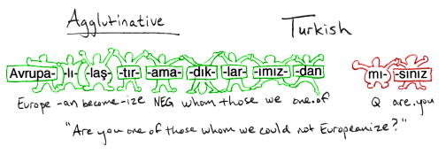
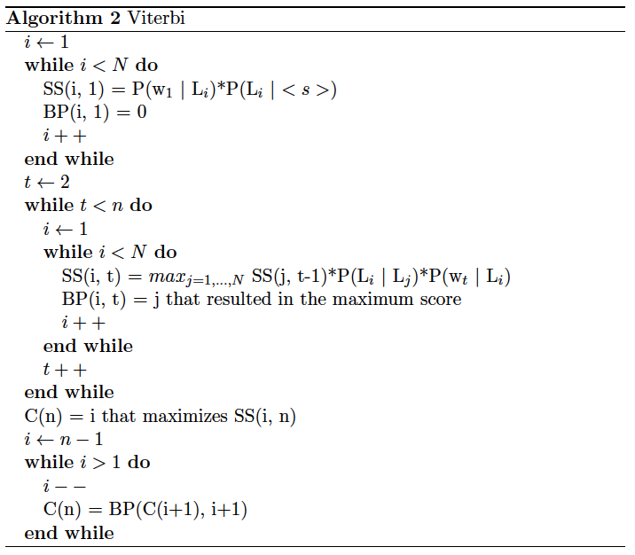

* [Home](../index.md)

# Morphology? What is it? Is there a cure?

> Text by: [Luísa Coheur](authors.md)

**Morphology** is the linguistics field dedicated to the study of the internal
structure of words (morph = shape, logos = word).

&nbsp;&nbsp;&nbsp;&nbsp;&nbsp;Being able to determine the morphology of words can be extremely important
to get, for instance, their accurate lemmas; it is also a fundamental
step should a syntactic analysis be required. Many applications are based on
some morphological processing. For instance, if you want to know whether
two words in different languages have the same origin (organization vs. organização), 
that is, if they are **cognates** (another fancy word to impress
your friends), morphology can help.

 

&nbsp;&nbsp;&nbsp;&nbsp;&nbsp;In this chapter we will study words' constituents (morphologic parsing)
and we will see different techniques to mark words in a text with morphosyntactic tags.

&nbsp;&nbsp;&nbsp;&nbsp;&nbsp;This chapter is particularly inspired by [Jurasfsky’s book](https://web.stanford.edu/~jurafsky/slp3/), 
previous [Nuno Mamede](https://www.l2f.inesc-id.pt/w/Nuno_Mamede)'s slides and also the slides of Sudeshna Sarkar. All the silly jokes
and mistakes are on me.

## Dissecting words into morphemes

Words are constituted by (meaningful) units called **morphemes**. There are
two types of morphemes:
1. **stems**, which carry the primary of meaning of words;
2. **affixes**, which change stems meaning and/or have grammatical functions. They come in different types:
    * **prefixes:** added at the beginning of the word. For instance, anti from _anti-motim_, or _des_ from _desinteressante_;
    * **suffixes:** appear at the end of the word. An example is _os_ from _gatos_, _alunos_, etc.
    * **infixes:** are inserted inside the stem
    * **circumfixes:** precede and follow the stem and are inserted at the same time. For instance, _amanhecer_ has this type of affix.
    * **clitics:** these are morpheme that function like a word, but that do not appear alone. Example: _os_ in _vi–os_.

&nbsp;&nbsp;&nbsp;&nbsp;&nbsp;There are languages (called **agglutinative Languages**) where words can contain an impressive number of morphemes. 
Turkish, for instance, has many words with 9 or 10 morphemes.

<figcaption> Image taken from <a href="http://specgram.com/CLII.3/09.phlogiston.cartoon.3.html">http://specgram.com/CLII.3/09.phlogiston.cartoon.3.html</a> </figcaption>

---

**Exercise 22: Dissecting Portuguese**

&nbsp;&nbsp;&nbsp;&nbsp;&nbsp;Consider the word _inacreditavelmente_. Can you find a portuguese word with
more morphemes? If you do, let me know.

---

## Building words

There are many different ways of building words from a word stem. Here
are some of them:

* Inflection: Doesn't change the word class or the meaning of the word, considering the original stem. Examples are _eats_ from _eat_ (both verbs) and _gatas_ from _gato_ (both nouns).
* Derivation: Results in a word from a different word class or with a different meaning. Examples are _do_ from _undo_ (opposite meanings) and _amigável_ from _amigo_ (adjective and noun).
* Compounding: Combination of multiple word stems. _doghouse_ and _guarda-chuva_ are examples of this.
* Cliticization: Words with clitics, such as _apagou-o_.
* ...

&nbsp;&nbsp;&nbsp;&nbsp;&nbsp;Just to show you how strange this can be, have the following example (for
Hebrew), representing a case of **Templatic** morphology with triconsonantal
stems:

&nbsp;&nbsp;&nbsp;&nbsp;&nbsp;Considering that _lmd_ means to learn or study:
* CaCaC triggers lamad (_he studied, ..._)
* CiCeC triggers limed (_he taught, ..._)
* CuCaC triggers lumad (_he was taught, ..._)

&nbsp;&nbsp;&nbsp;&nbsp;&nbsp;Original, isn't it?

## Part-of-speech tagging

**Part-of-speech tagging** or **POS tagging** is the process of automatically
assigning a morpho-syntactic tag to each word in a text. The main problem
here is our darling friend ambiguity, but not because there are many ambiguous
words. The problem is that these ambiguous words are extremely
frequent in texts.

&nbsp;&nbsp;&nbsp;&nbsp;&nbsp;We will study three main approaches: a) Rule-based; b) Hybrid; c)
Stochastic.

### Rule-based approach

The rule-based approach uses hand-crafted rules to tag a text. Usually,
there are two main steps:
1. With the help of a dictionary, you tag each word with all its possible labels;
2. With the help of a set of (disambiguation) rules, you disambiguate these labels.

&nbsp;&nbsp;&nbsp;&nbsp;&nbsp;As an example, consider the sentence _He had a book_. After the first step,
you might have:

* he he/pronoun
* had have/verbpast have/auxliarypast
* a a/article
* book book/noun book/verb

&nbsp;&nbsp;&nbsp;&nbsp;&nbsp;If there is a rule that states that _if the previous word is an article, remove
all the labels related with verbs_, after the application of this rule, we obtain:

* he he/pronoun
* had have/verbpast have/auxliarypast
* a a/article
* book book/noun

An example of a rule-based tagger is the [EngCG tagger](http://www2.lingsoft.fi/doc/engcg/intro/). If you have
time, give it a once-over.

### Transformation based POS tagging

The **transformation based POS tagging** is also known as **Brill Tagging**.
It is also rule-based, but its rules are learned from a labeled corpus
(that is why is said to be an hybrid approach). It takes the following steps:

* Each word is tagged with the most frequent label;
* Transformational rules are learned from a labeled corpus (rules that replace labels);
* Transformational rules are applied until some stop condition is reached.

For instance, assume that you know that:

$$ P(\text{NN/race}) = 0.98 $$

$$ P(\text{VB/race}) = 0.02 $$

&nbsp;&nbsp;&nbsp;&nbsp;&nbsp;Then, the sentence _He is expected to race tomorrow_ will be labeled as:
* he/PRN
* is/VBZ
* expected/VBN
* to/TO
* race/NN (not good!)
* tomorrow/NN

&nbsp;&nbsp;&nbsp;&nbsp;&nbsp;If you have a rule that says that you should _Replace NN by VB when the
previous label is TO_, the correct labelling will be attained.

### Stochastic approach

The target here is to choose the best sequence of tags,

$$ T = t_1, t_2, ..., t_n $$

&nbsp;&nbsp;&nbsp;&nbsp;&nbsp;for a certain sequence of words

$$ W = w_1, w_2, ..., w_n $$

&nbsp;&nbsp;&nbsp;&nbsp;&nbsp;That is, we want to calculate $$ t \in \tau$$ that maximizes $$ P(T | W) $$, being $$ \tau $$
the set of all possible tags' sequences:

$$ \arg\max_{t \in \tau} P(T|W) $$

&nbsp;&nbsp;&nbsp;&nbsp;&nbsp; As it is difficult to calculate 
$$ P(T | W)$$
, we can use Bayes Rule:

$$ P(x|y) = P(y|x) \frac{P(x)}{P(y)} $$

&nbsp;&nbsp;&nbsp;&nbsp;&nbsp;and as $$P(W)$$ does not depend on $$T$$, our problem is now to calculate:

$$ \arg\max_{t \in \tau} P(W|T) \times \frac{P(T)}{P(W)} \equiv \arg\max_{t \in \tau} P(W|T) \times P(T)$$

Note that:
* $$ P(T) $$
 is the prior probability of the sequence of tags;
* $$P(W | T)$$ 
is the likelihood of W being given T.

---

**Exercise 23: Why is posterior distribution hard to calculate?** 

&nbsp;&nbsp;&nbsp;&nbsp;&nbsp;Think why it is more difficult to calculate 
$$ P(T | W) $$
 than 
 $$ P(W | T)$$
.

---

#### The Hidden Markov Models

Unfortunately, the previous formula is still too difficult to calculate and
the famous **Hidden Markov Models (HMM)** are called to save the day.
These models assume that the system in hands can be modeled as a Markov
Process (remember?) with non observable (hidden) states. Basically, they
assume that:

* The probability of occurrence of a word only depends on its label (that is, it doesn’t depend on other words);
* The probability of a tag only depends on the previous tag (this is called the bigram assumption).

Due to this, the following approximations can be done:

$$ P(W|T) \approx \prod_{i=1}^n P(w_i|t_i) $$

$$ P(T) \approx \prod_{i=1}^n P(t_i|t_{i-1}) $$

Therefore, the formula that we need to calculate is now given by:

$$ \arg\max_{t \in \tau} P(W|T) \times P(T) \approx \prod_{i=1}^n P(w_i|t_i)P(t_i|t_{i-1}) $$

The good news is that we now know how to calculate this:

$$ P(t_i|t_{i-1}) = \frac{C(t_{i-1} t_i)}{C(t_{i-1})} $$

$$ P(w_i|t_i) = \frac{C(t_i, w_i)}{C(t_i)} $$

#### Viterbi algorithm

For models such as HMM that contain hidden variables, the task of determining
which of the variables is the source of an observable sequence is
called decoding. The Viterbi algorithm is often used with HMMs and
it seeks the best path; it is based on probabilities and uses the technique
of **dynamic programming** (solve small problems and memorize the best
solution).

&nbsp;&nbsp;&nbsp;&nbsp;&nbsp;Considering that:

* $$ N = \#  \{L_1, ..., L_n\} $$;
* $$ n = $$ number of words in the given sequence $$ w_1, ..., w_n $$;
* SS is an array $$ N \times n $$ that registers the best punctuation of the best sequence found until a certain position with label $$ L_i $$;
* BP is an array $$ N \times n $$ that registers the best probability of a transition from the previous to the current state;
* C is an array $$ 1 \times n $$ that registers the best sequence of labels.

&nbsp;&nbsp;&nbsp;&nbsp;&nbsp;Then, the Viterbi algorithm works as follows:

 

---

**Exercise 24: Viterbi**

&nbsp;&nbsp;&nbsp;&nbsp;&nbsp;Consider the labels N and V, and the sequence of words A B A. Knowing the
following probabilities, use Viterbi to calculate the best sequence of labels for that sequence of words:

* 
$$ P(N | <s>) = 0.25 $$
, 
$$ P(V | <s>) = 0.3 $$
* 
$$P(A|N) = 0.1$$
,
$$P(A|V) = 0.3$$
,
$$P(B|N) = 0.2$$
,
$$P(B|V) = 0.4$$
* 
$$P(N|V) = 0.15$$
,
$$P(N|N) = 0.2$$
,
$$P(V|V) = 0.75$$
,
$$P(V|N) = 0.25$$

---

## Very brief review of Portuguese morphology – back to school

Each word can have more than one morphological tag, according with its
function in a sentence. For instance, you can say _Estava uma noite escura |
branca | clara | amarela | verde_, but you can't say _Estava uma noite de_ or
_Estava uma noite dormir_. That is, if you have an adjective, you can replace
it by another adjective, but not with a preposition or a verb (an exception are
nouns and pronouns). You don't remember what a pronoun or a preposition
is? Well, let us review some morphological classes (remember this, because
you will need it for the Syntax chapter); capitalized words illustrate each
class:

* Nouns: _JOAQUIM estava a ler na SALA quando ouviu um BARULHO no JARDIM._
* Determiners: _Era UM ruído estranho, O mais estranho de sempre, UM leve e suave arrastar._
* Pronouns: __Sem que ELE o conseguisse evitar, sentiu o SEU coração a começar a bater com força._
* Verbs: _DIRIGIU-SE à porta, mas PAROU, com a maçaneta na mão._
* Adjectives: _Sentia um pavor INDESCRITÍVEL a entranhar-se no corpo._
* Adverbs: _LENTA e FIRMEMENTE um frio glaciar subia por ele acima._
* Prepositions: _O que estaria DO outro lado DA porta? O que estaria NO jardim?_
* Conjunction: _Tremendo, Joaquim abriu a porta E espreitou._
* Interjections: _Nem teve tempo de gritar "AQUI D'EL REI", "DIACHO" ou "IRRA"._

  <a href="chap_5.html" style="float: left;">❮ Previous chapter</a>
  <a href="chap_7.html" style="float: right;">Next chapter ❯</a>

  